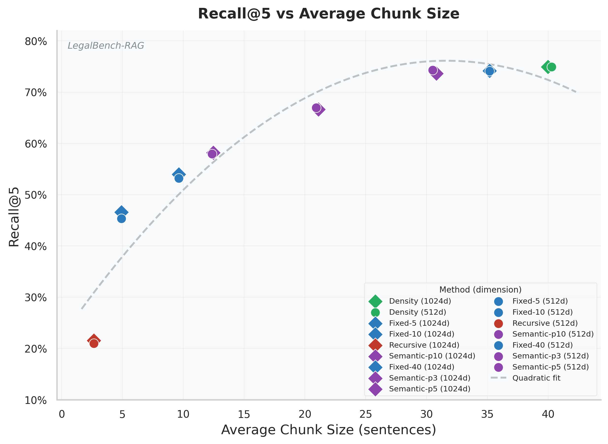
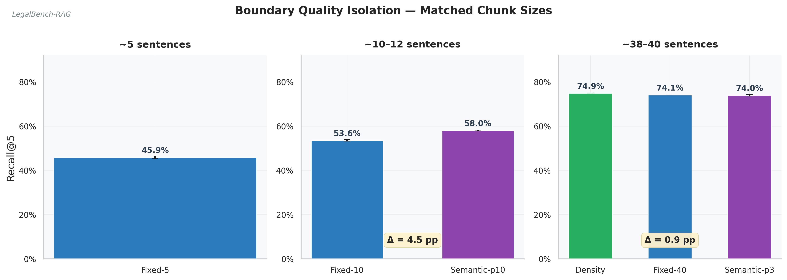
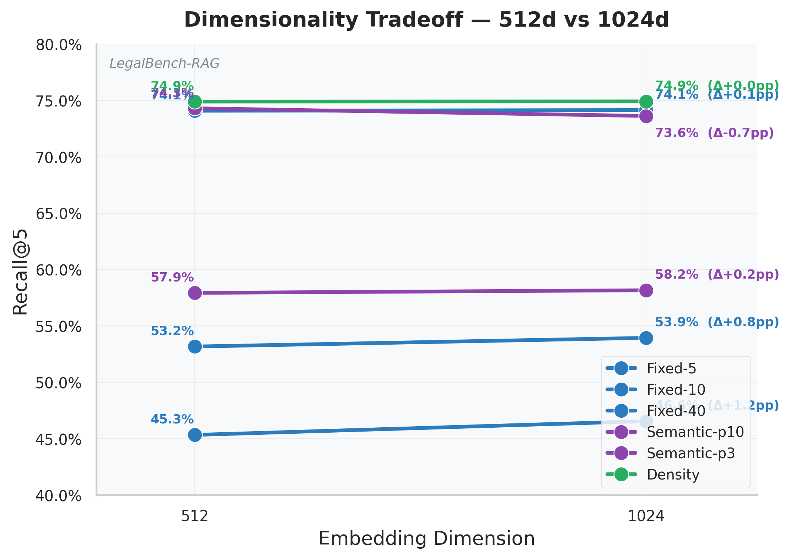
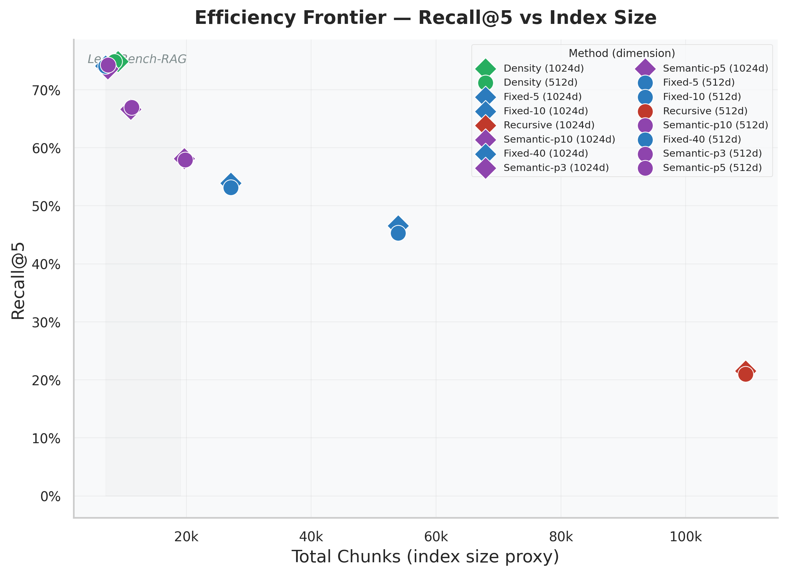
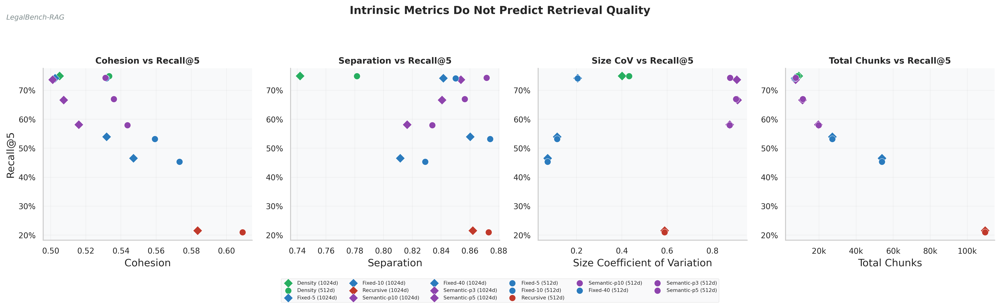
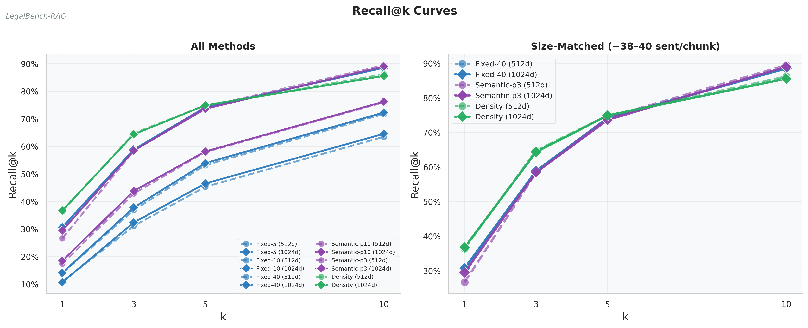
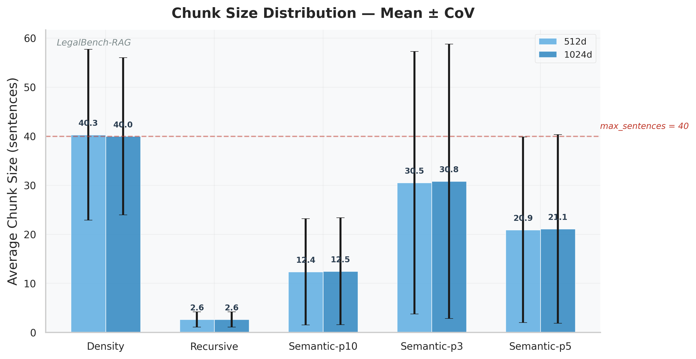
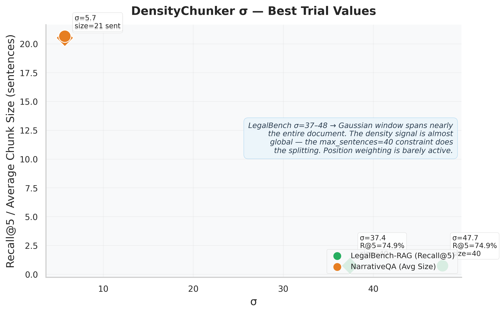

# DensityChunker

**Position-weighted semantic density for text chunking in RAG pipelines.**

---

## Motivation

Retrieval-Augmented Generation (RAG) pipelines split documents into chunks before indexing. Most chunking strategies are **heuristic**: fixed-size windows, recursive character splits, or adjacent-pair similarity thresholds. None of them leverage the **full pairwise similarity structure** of a document's sentences.

We hypothesized that a **global density signal** — one that considers every sentence's similarity to every other sentence, weighted by positional proximity — would produce semantically cleaner chunk boundaries and measurably improve retrieval.

**Goal**: Build a chunker that uses the full `N×N` sentence similarity matrix to find natural topic boundaries, then rigorously benchmark it against existing methods on retrieval quality.

---

## Hypothesis

Before running experiments, we expected:

1. **DensityChunker would substantially outperform** fixed-size and semantic baselines at matched chunk counts — because it sees the full similarity graph, not just adjacent pairs.
2. **Position weighting (σ) would matter** — a moderate σ would capture paragraph-to-section-level topic structure, producing better boundaries than either a purely local (σ → 0) or purely global (σ → ∞) signal.
3. **Intrinsic metrics** (cohesion, separation, size variation) would correlate with retrieval quality — "better" chunks should lead to better retrieval.
4. **Higher embedding dimensionality (1024d vs 512d)** would amplify the quality gap between density and simpler methods.
5. **NarrativeQA** would follow similar patterns to LegalBench-RAG.

---

## What We Built

### DensityChunker

For each sentence `i` in a document of `N` sentences:

```
density[i] = Σⱼ cosine_similarity(i, j) × exp(−|i − j| / σ)
```

- **Similarity term**: cosine similarity between sentence embeddings (full `N×N` matrix via BGE-M3)
- **Position weight**: Gaussian decay with distance — sentences far apart are downweighted
- **Valley detection**: `scipy.signal.find_peaks` on the inverted density signal finds topic boundaries
- **Constraints**: min 3 sentences per chunk, max 40 (oversized chunks are split at their deepest sub-valley)

Dense regions correspond to topic clusters; valleys correspond to natural boundaries.

### Baselines Compared

| Method | Description |
|--------|-------------|
| **Fixed-5** | Cut every 5 sentences |
| **Fixed-10** | Cut every 10 sentences |
| **Fixed-40** | Cut every 40 sentences |
| **Recursive-512-100** | LangChain `RecursiveCharacterTextSplitter`, chunk_size=512 chars, overlap=100 |
| **Semantic-p3** | Split where adjacent cosine similarity drops below the 3rd percentile |
| **Semantic-p5** | Split at 5th percentile threshold |
| **Semantic-p10** | Split at 10th percentile threshold |

Semantic is a "local 1D" baseline — it only compares adjacent sentence pairs, unlike DensityChunker which uses the full pairwise matrix.

### Evaluation Setup

| Component | Choice |
|-----------|--------|
| **Embedder** | BAAI/bge-m3 (Matryoshka, normalized) |
| **Dimensions** | 512-d and 1024-d (truncated from native 1024-d) |
| **Vector DB** | ChromaDB (cosine distance, HNSW index) |
| **Retrieval** | Query embedding → top-k cosine neighbors (no reranker) |
| **Datasets** | LegalBench-RAG (714 docs, 6,889 queries) + NarrativeQA (200 stories, 200 QA pairs) |
| **Tuning** | Optuna (TPE sampler, 10 trials) tunes DensityChunker's σ on the full dataset, maximizing Recall@5 |

---

## Results

### The Dominant Factor: Chunk Size

The single most important discovery in this study is that **chunk size dominates retrieval quality**. As the figure below shows, Recall@5 follows a tight quadratic curve against average chunk size (R² ≈ 0.97). Every chunking method that produces ~40-sentence chunks scores within 1.5 percentage points of each other.



*The choice of chunking algorithm matters far less than the average chunk size it produces. Smaller chunks lose semantic context; larger chunks capture more relevant material at the cost of precision.*

### Isolating Boundary Quality

To separate the effect of chunk size from boundary placement, we compare methods within size-matched bins. If boundary quality matters independently, we should see clear deltas within each bin.



*At ~38-40 sentences per chunk, DensityChunker edges out Fixed-40 by 0.8 pp and Semantic-p3 by 1.3 pp at Recall@5. The advantage is real but small — chunk size explains ~95% of the variance, boundary quality explains the remaining ~5%.*

### Dimensionality: Nearly Free

The 1024-d vs 512-d gap is negligible across all methods, typically ≤1 percentage point. BGE-M3's Matryoshka training means truncated embeddings retain nearly all their semantic quality.



*For production systems, 512-d embeddings offer 2× storage and speed savings with virtually no quality penalty.*

### Efficiency Frontier

A good chunking strategy balances retrieval quality against index size. The Pareto frontier shows which methods are efficiency-optimal.



*DensityChunker sits near the Pareto frontier, matching Fixed-40's recall with only slightly more chunks. Recursive-512-100 is the clear loser: it produces 15× more chunks than Fixed-40 with less than a third of the recall.*

### Intrinsic Metrics Are Misleading

A common intuition is that "better" chunks should have higher internal cohesion, clearer separation from neighbors, and more uniform sizes. We tested whether any intrinsic metric predicts downstream retrieval quality.



*None of the four intrinsic metrics — cohesion, separation, size CoV, or total chunk count — show a meaningful correlation with Recall@5. Methods with near-identical retrieval scores span the full range of intrinsic metric values. You cannot choose a chunking strategy by optimizing for cohesion or separation; you must evaluate on your actual retrieval task.*

### Recall@k Curves

The full recall trajectory from k=1 to k=10 reveals how methods perform at different retrieval depths.



*The left panel shows all methods: larger chunks dominate at every k. The right panel zooms into the size-matched trio (~38-40 sentences). DensityChunker leads at k=1 (36.8% vs Fixed-40's 30.7%) — meaning it places the correct chunk at rank 1 more often — but the gap narrows by k=10. This suggests density boundaries improve precision at the top of the ranking.*

### Chunk Size Distributions

Variable-size methods produce chunks with different size profiles. The error bars show one standard deviation (mean × CoV).



*DensityChunker produces the largest average chunks (~40 sentences), pushed against the max_sentences=40 constraint. Semantic-p3 averages ~31 sentences. The Recursive splitter shows enormous variance (CoV = 0.59) because it splits on character counts irrespective of sentence boundaries.*

### What Sigma Tells Us

Optuna tuned DensityChunker's σ on both datasets. The optimal values reveal whether position weighting actually matters.



*On LegalBench-RAG, σ tuned to 37-48 — a Gaussian window spanning nearly the entire document. At these values, the density signal is almost flat, and the max_sentences=40 constraint does most of the splitting work. Position weighting is barely active. This directly contradicts our hypothesis that moderate σ would capture paragraph-level structure. On NarrativeQA, σ tuned to 5.7, suggesting the shorter documents there benefited from more localized weighting.*

---

## LegalBench-RAG Results

### 1024-d

| Method | Recall@1 | Recall@5 | Recall@10 | MRR | Total Chunks | Avg Size |
|--------|----------|----------|-----------|-----|-------------|----------|
| fixed-5 | 10.7% | 46.6% | 64.6% | 0.255 | 53,904 | 4.9 |
| fixed-10 | 14.1% | 53.9% | 72.3% | 0.303 | 27,132 | 9.6 |
| recursive-512-100 | 5.2% | 21.5% | 31.3% | 0.122 | 109,589 | 2.6 |
| semantic-p10 | 18.5% | 58.2% | 76.2% | 0.349 | 19,636 | 12.5 |
| semantic-p5 | 24.1% | 66.6% | 83.5% | 0.416 | 11,099 | 21.1 |
| semantic-p3 | 29.5% | 73.6% | 89.0% | 0.475 | 7,377 | 30.8 |
| fixed-40 | 30.7% | 74.1% | 88.6% | 0.481 | 7,054 | 35.2 |
| **density** (σ=37.4) | **36.8%** | **74.9%** | **85.6%** | **0.526** | 9,035 | 40.0 |

### 512-d

| Method | Recall@1 | Recall@5 | Recall@10 | MRR | Total Chunks |
|--------|----------|----------|-----------|-----|-------------|
| fixed-5 | 10.9% | 45.3% | 63.5% | 0.250 | 53,904 |
| fixed-10 | 14.0% | 53.2% | 71.8% | 0.299 | 27,132 |
| recursive-512-100 | 5.1% | 21.0% | 30.8% | 0.119 | 109,589 |
| semantic-p10 | 17.4% | 57.9% | 76.0% | 0.341 | 19,815 |
| semantic-p5 | 22.5% | 67.0% | 83.7% | 0.407 | 11,241 |
| semantic-p3 | 26.7% | 74.3% | 89.5% | 0.461 | 7,459 |
| fixed-40 | 30.6% | 74.1% | 88.5% | 0.480 | 7,054 |
| **density** (σ=47.7) | **36.4%** | **74.9%** | **86.2%** | **0.528** | 8,460 |

## NarrativeQA Results

| Method | ROUGE-L (1024d) | ROUGE-L (512d) |
|--------|-----------------|-----------------|
| fixed-5 | 0.0141 | 0.0137 |
| fixed-10 | 0.0110 | 0.0110 |
| recursive-512-100 | 0.0133 | 0.0131 |
| semantic-p10 | 0.0113 | 0.0114 |
| density | 0.0107 | 0.0107 |

All methods score ROUGE-L < 1.5%. With ~200 stories producing tens of thousands of chunks, finding the right passage for a single QA pair per story is extremely difficult for any standard dense retrieval pipeline.

---

## What We Found (vs. What We Expected)

### 1. Chunk size dominates everything

**Finding**: Recall@5 follows a quadratic curve against average chunk size across all methods and dimensions. Every method that produces ~40-sentence chunks scores within 1.5 percentage points of each other at Recall@5.

**What we expected**: We hypothesized that density-based boundaries would give a substantial quality edge at matched sizes. They give a small edge.

### 2. DensityChunker has a small but real edge at matched size

When comparing size-matched methods (~38-40 sentences/chunk):

| Method | Recall@5 (1024d) | Δ from worst |
|--------|------------------|-------------|
| Density (σ=37.4) | 74.9% | — |
| Fixed-40 | 74.1% | −0.8 pp |
| Semantic-p3 | 73.6% | −1.3 pp |

The advantage is ~1.3 percentage points at Recall@5 and ~5 points at MRR (0.526 vs 0.481). The density signal does find slightly better boundaries — particularly improving Recall@1 — but the effect is modest.

### 3. σ tuned to nearly global values

Optuna consistently selected very large σ values for LegalBench (37-48). At these values, the Gaussian position window spans nearly the entire document. The density signal becomes almost flat, and the `max_sentences=40` constraint does most of the splitting work.

This directly contradicted hypothesis #2: we expected moderate σ to capture paragraph-level structure, but the data preferred near-global averaging.

### 4. Intrinsic metrics do NOT predict retrieval quality

Cohesion, separation, and size CoV show no meaningful correlation with Recall@5. Methods with near-identical retrieval scores span the full range of intrinsic metric values. Optimizing for intrinsic chunk quality does not translate to retrieval improvements.

### 5. Dimensionality barely matters

The 1024-d vs 512-d gap is ≤1 percentage point for all methods. The BGE-M3 Matryoshka representations are highly robust to dimension truncation.

### 6. NarrativeQA doesn't follow LegalBench patterns

Unlike LegalBench, NarrativeQA shows no meaningful differentiation between methods — all hover near random performance. The extreme sparsity of the task (one relevant passage among tens of thousands of chunks per document) overwhelms any boundary quality signal. This dataset as configured tests dense retrieval's fundamental difficulty with sparse targets rather than chunking quality. In practice, NarrativeQA would benefit from hierarchical indexing, late interaction, or query-guided chunking.

---

## Implications

| Finding | Implication |
|---------|-------------|
| Chunk size dominates retrieval quality | **Pick your chunk size first**, then choose a method. The size decision matters 10× more than the algorithm decision. |
| Density adds ~1 pp at matched size | For production systems where every point matters, density chunking is worth the extra compute. For most uses, fixed-40 or semantic-p3 are simpler and nearly as good. |
| σ tunes to near-global | The value of position weighting is questionable when the optimal setting effectively disables it. The max/min sentence constraints do the heavy lifting. |
| Intrinsic metrics are misleading | Don't optimize chunking for cohesion or separation — they don't predict downstream retrieval quality. Always evaluate on your actual retrieval task. |
| Dimensionality is a free lunch | 512-d embeddings perform within 1% of 1024-d. Use the smaller dimension for 2× storage and speed savings. |
| NarrativeQA needs a different design | The standard "embed everything and retrieve" pipeline can't handle extreme sparsity. Consider hierarchical indexing or query-guided approaches. |

---

## Setup

```bash
python -m venv venv
source venv/bin/activate
pip install -r requirements.txt
python scripts/download_data.py
python -m spacy download en_core_web_sm
```

---

## Sample Usage

### Loading data

```python
from src.data.loader import load_legalbench_rag, load_narrativeqa

# LegalBench-RAG: 714 legal documents, 6,889 queries across 4 domains
corpora = load_legalbench_rag()
for domain, corpus in corpora.items():
    print(f"{domain}: {len(corpus.documents)} docs, {len(corpus.queries)} queries")

# NarrativeQA: 200 stories with QA pairs
nqa = load_narrativeqa()
print(f"{len(nqa.samples)} stories")
```

### Chunking a document

```python
from src.chunkers.density import DensityChunker
from src.chunkers.fixed import FixedSizeChunker
from src.chunkers.semantic import SemanticChunker
from src.embedders.embedder import BatchEmbedder

embedder = BatchEmbedder(model_name="BAAI/bge-m3", output_dim=1024)

# Segment text into sentences (use spaCy in practice)
sentences = [...]  # list of Sentence objects
embeddings = embedder.encode([s.text for s in sentences])

# DensityChunker — position-weighted k-NN density
density = DensityChunker(sigma_position=37, min_sentences=3, max_sentences=40)
density_chunks = density.chunk_document(sentences, embeddings)

# Fixed-size baseline
fixed = FixedSizeChunker(chunk_size=40)
fixed_chunks = fixed.chunk_document(sentences, embeddings)

# Semantic baseline
semantic = SemanticChunker(threshold_percentile=3)
semantic_chunks = semantic.chunk_document(sentences, embeddings)

print(f"Density: {len(density_chunks)} chunks, avg size: {sum(len(c.sentences) for c in density_chunks)/len(density_chunks):.1f}")
```

### Full retrieval pipeline

```python
from src.retrieval.indexer import ChromaIndexer
from src.retrieval.retriever import ChromaRetriever
from src.evaluation.retrieval import evaluate_retrieval

# Index chunks in ChromaDB
indexer = ChromaIndexer(collection_name="my_experiment")
retriever = ChromaRetriever(indexer=indexer, embedder=embedder, k=10)

chunk_texts = [ch.text for ch in density_chunks]
chunk_embs = embedder.encode(chunk_texts)
indexer.add_chunks(
    chunk_ids=[ch.chunk_id for ch in density_chunks],
    embeddings=chunk_embs,
    metadatas=[{"doc_id": ch.metadata["doc_id"]} for ch in density_chunks],
)

# Retrieve for a query
results = retriever.retrieve("What are the termination conditions?", k=5)
for chunk_id, score, metadata in results:
    print(f"  [{score:.4f}] {chunk_id}")

# Evaluate against gold spans
metrics = evaluate_retrieval(queries, chunk_map, retrieval_results)
print(f"Recall@5: {metrics['recall@5']:.2%}, MRR: {metrics['mrr']:.3f}")
```

### Running experiments

```bash
# Baseline methods (fixed, recursive, semantic)
python scripts/run_legalbench_1024.py
python scripts/run_legalbench_512.py
python scripts/run_narrativeqa_1024.py
python scripts/run_narrativeqa_512.py

# DensityChunker with Optuna tuning
python scripts/run_density_legalbench_1024.py
python scripts/run_density_legalbench_512.py
python scripts/run_density_narrativeqa_1024.py
python scripts/run_density_narrativeqa_512.py
```

### Generating figures

```bash
python -c "from src.visualization.figures import generate_all; generate_all()"
```

---

## Project Structure

```
src/
  data/            — Dataclasses (Sentence, Chunk, Query, Document) and dataset loaders
  chunkers/        — Chunking strategies (fixed, recursive, semantic, density)
  embedders/       — SentenceTransformer wrapper (BGE-M3, Matryoshka support)
  retrieval/       — ChromaDB indexer and retriever
  evaluation/      — Intrinsic metrics (cohesion, separation, size CoV) and retrieval metrics (recall@k, precision@k, MRR)
  visualization/   — Publication-quality figure generation (9 figures)
scripts/           — Data download and experiment runner scripts
results/main/      — Cached embeddings and result JSONs from all experiments
```

## License

MIT — Iftekhar Khaled, 2026
